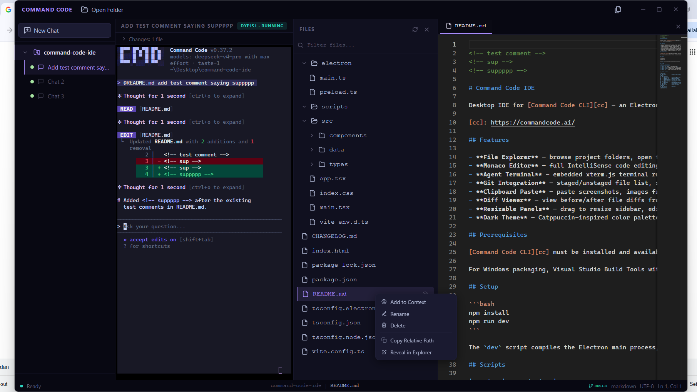

# Termina

<a href="https://buymeacoffee.com/yazanbaker" target="_blank" rel="noopener noreferrer"></a>

Desktop IDE — an Electron + React + TypeScript app with an embedded terminal, file explorer, Monaco code editor, and Git support.



## Features

- **File Explorer** — browse project folders, open files for editing
- **Monaco Editor** — full IntelliSense code editing with syntax highlighting
- **Agent Terminal** — embedded xterm.js terminal via node-pty
- **Git Integration** — staged/unstaged file list, stage/unstage/commit with status bar feedback
- **Clipboard Paste** — paste screenshots, images from clipboard, or files into the project. On Windows, falls back to Explorer's FileDropList via PowerShell when Electron's clipboard API misses Explorer-copied files.
- **Diff Viewer** — view before/after file diffs from agent changes, revert individual files
- **Resizable Panels** — drag to resize sidebar, editor, and agent panel
- **Dark Theme** — Catppuccin-inspired color palette

## Prerequisites

The `command-code` CLI must be installed and available as `command-code` (or `command-code.cmd` on Windows) in your PATH.

For Windows packaging, Visual Studio Build Tools with the C++ workload is required to compile native modules (node-pty).

## Setup

```bash
npm install
npm run dev
```

The `dev` script compiles the Electron main process, starts the Vite dev server on port 5173, then launches the Electron window.

## Scripts

| Script | Description |
|--------|-------------|
| `npm run dev` | Start in development mode |
| `npm run build` | Compile TypeScript + bundle renderer |
| `npm start` | Launch Electron with production build |
| `npm run package` | Build + output unpacked Windows app (`release/`) |
| `npm run dist` | Build + create Windows NSIS installer |

## Project Structure

```
├── electron/
│   ├── main.ts              # Electron main process (file ops, agent, git, IPC)
│   └── preload.ts           # Context bridge (window.electronAPI)
├── src/
│   ├── components/
│   │   ├── Toolbar.tsx      # App toolbar with window controls
│   │   ├── FileTree.tsx     # File tree explorer
│   │   ├── Editor.tsx       # Monaco code editor
│   │   ├── AgentPanel.tsx   # Terminal, git status, changed files
│   │   ├── DiffViewer.tsx   # Before/after file diff viewer
│   │   └── BottomBar.tsx    # Status bar
│   ├── types/
│   │   └── index.ts         # Shared TypeScript interfaces
│   ├── App.tsx              # Root component + state management
│   ├── main.tsx             # React entry point
│   └── index.css            # Dark theme styles
├── build/
│   └── icon.ico             # App icon
├── package.json
└── tsconfig*.json
```
